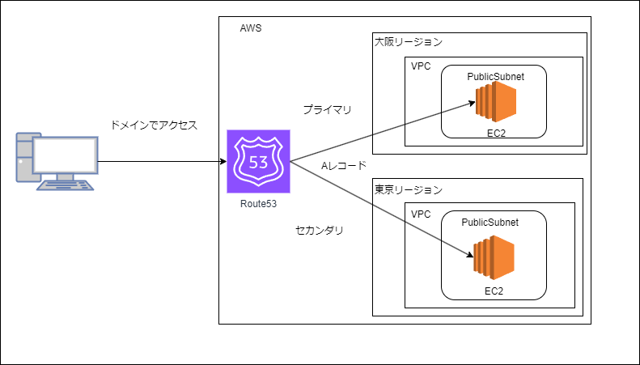

# multi-region-failover

# 概要説明
マルチリージョン構成でフェイルオーバーを行います。  

### 作成するもの

### 最小構成でマルチリージョン構成を作成  
- 各リージョンにVPC1つ、パブリックサブネット内にEC2をWEBサーバーとして置く。
- EC2にEIP（IPv4）を割り当ててそれをパブリックIPとする。
- 外部ドメインをとって、Route53ホストゾーン作成時にそれを使う。
- AWSアクセスはDNSで、AWSへはAレコード（IPアドレス）でアクセスできるようにRoute53フェイルオーバールーティングに設定。  
その際に大阪リージョンへのルートをプライマリ、東京リージョンへのルートをセカンダリに設定する。
- 正常時のアクセスは常に大阪リージョンのEC2へと流れるが、大阪リージョンの障害発生時は東京リージョンへとアクセスされるようになる。
 

# 事前準備
- AWSアカウント
- [Teraterm 5.0 beta1](https://osdn.net/projects/ttssh2/releases/78350)：以下の「3.EC2接続」にてSSH接続する際に使用します。  
versionが5.0以下の場合、キーペアの認証で失敗します。  
理由は[この記事](https://www.cloudbuilders.jp/articles/3200/)見ると分かります。
- 外部ドメイン：以下の「Route53ホストゾーン構築」と「フェイルオーバールーティング設定」にて使用します。  
今回はAWSのドメインではなく、自前で準備した外部ドメインを使用します。

# 詳細はこちら  
以下のリンクのNoが手順となります。  

[1. VPC構築](console/1.VPC構築.md)  

[2. EC2起動](console/2.EC2起動.md)  

[3. EC2接続](console/3.EC2接続.md)  

[4. Route53ホストゾーン構築](console/4.Route53ホストゾーン構築.md)  

[5. フェイルオーバールーティング設定](console/5.フェイルオーバールーティング設定.md)  
