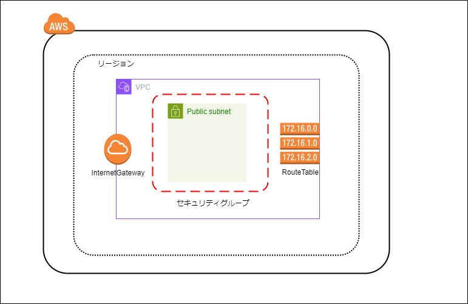

# VPC構築
EC2をアタッチするためのVPC、パブリックサブネットを構築します。  
以降でアタッチするEC2をWEBサーバーとしてアクセスしたいので、InternetGatewayとそれに対応する形でセキュリティグループを設定します。


### 作成するもの


- VPC
- サブネット
- ルートテーブル
- InternetGateway
- セキュリティグループ


### VPCを構築して、関連するサブネット、SG、IGW、ルートテーブルを作成します。  
AWSマネジメントコンソールの操作にて行います。  
○○作成からと記載がありますが、「VPCダッシュボード」からそれぞれのメニューへと遷移することができ、サイドメニューから選択すると中央の画面（右上）に○○作成と表示があるためそこから操作を実施する。
<br>
<br>

# 手順  

### 1. VPC作成  
  コンソールのVPC作成から、以下のように設定しVPCを作成する。

  ```
    ・作成するリソース：VPCのみ
    ・名前：｛任意｝
    ・IPv4 CIDRブロック：IPv4 CIDRの手動入力
    ・IPv4 CIDR：｛任意今回は→｝10.11.0.0/24 
    ・IPv6 CIDRブロック：IPv6 CIDR ブロックなし
    ・テナンシー：デフォルト
  ```


&emsp;&emsp;今回は作業環境の兼ね合いでIPv4のまま最後までいきますが…  
&emsp;&emsp;最近IPv4使用料が時間当たりの料金で発生するようになりましたので  
&emsp;&emsp;それが気になる方はIPv6で構築することをお勧めします。


### 2. サブネット作成

  コンソールのVPC作成から、以下のように設定しVPCを作成する。

  ```
    ・サブネット名：｛任意｝
    ・アベラビリティゾーン：｛任意今回は→｝東京(ap1 a)
    ・IPv4 VPC CIDRブロック：1で作成したVPCのCIDR(10.11.0.0/24)
    ・IPv4 サブネット CIDRブロック：｛任意今回は→｝10.11.0.0/28 
    その他はデフォルト状態
  ```

  ### 4. ルートテーブル作成

  コンソールのルートテーブル作成から、以下のように設定しルートテーブルを作成する。

  ```
    ・名前：｛任意｝
    ・VPC：1で作成したVPC
    その他はデフォルト状態
  ```

  ### 5. インターネットゲートウェイ作成

  コンソールのインターネットゲートウェイ作成から、以下のように設定しインターネットゲートウェイを作成する。

  ```
    ・名前：｛任意｝
    その他はデフォルト状態
  ```
  
  ### 5. インターネットゲートウェイをVPCにアタッチする
  以下の画像のように、5で作成したインターネットゲートウェイにチェックを入れ選択状態にし、画面上部の「アクション」を押下する。  
  表示内容から「VPCにアタッチ」を押下する。
  

  以下のように設定する。  
  
  ```
    ・使用可能なVPC：1で作成したVPC
  ```

  ### 6. セキュリティグループ作成
  コンソールのセキュリティグループ作成から、以下のように設定しセキュリティグループを作成する。

  ```
    ・セキュリティグループ名：｛任意｝
    ・説明：｛任意｝
    ・VPC：1で作成したVPC
    ・インバウンドルール: 以下の画像のように設定
    ・アウトバウンドルール: 今回は設定しません
    その他はデフォルト状態
  ```
  

  ### 7. ルートテーブルの作成
  コンソールのルートテーブル作成から、以下のように設定しルートテーブルを作成する。

  ```
    ・送信先：0.0.0.0/0
    ・ターゲット：インターネットゲートウェイ
    その他はデフォルト状態
  ```
  以下参考です。
  

  ### 8. ルートの確認と編集
  ここまでで必要なものは作成したのですが、以下の画像のようにサブネットがデフォルトのルートテーブルとなっている場合があります。これでは以降の作業が上手くいかないため編集します。
  

  1. コンソールの「サブネット」を開き、2で作成したサブネットを選択した状態で「アクション」をクリックすると「ルートテーブルの関連付けを編集」と表示されるのでそこをクリック

  2. ルートテーブルIDに7で作成したルートテーブルを選択すると以下の画像のようにサブネットに対して設定したいルートテーブルが紐づいた状態となります。
  
  この状態は、2で作成したサブネットに対してインターネットゲートウェイと外部アクセス許可を行う```0.0.0.0/0``` のアクセスを許可するルールが適用されたことになります。

<br>
<br>
<br>

### 以上でVPC構築は終わりとなります。次はEC2起動となります。


